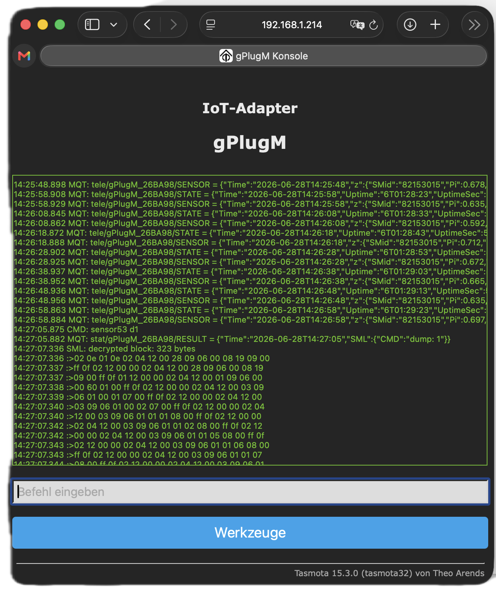
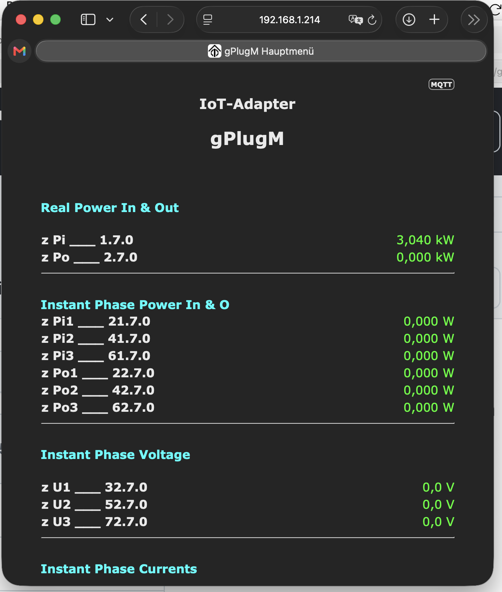
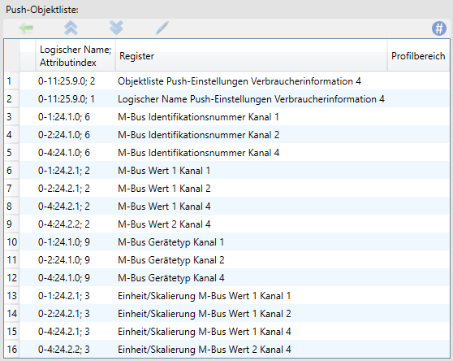
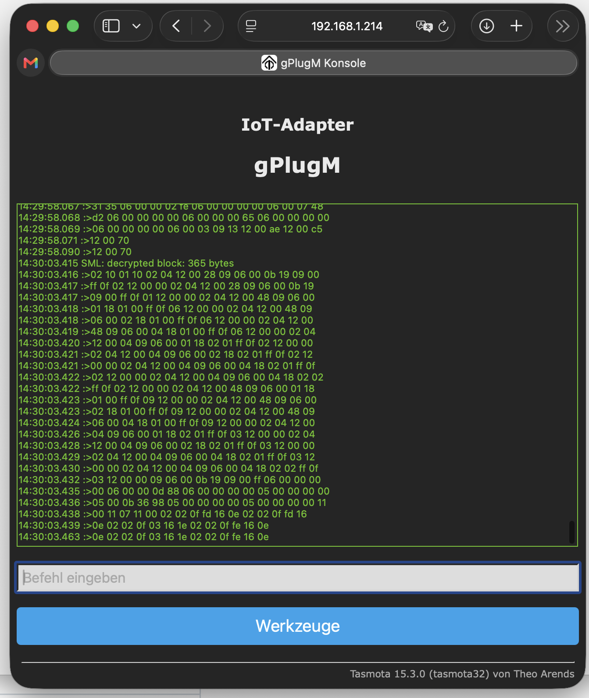
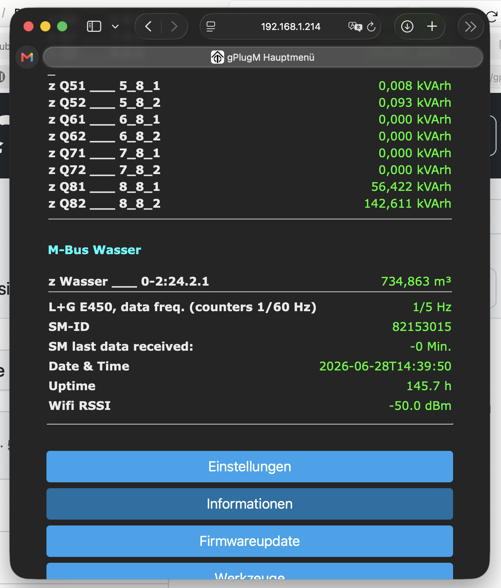
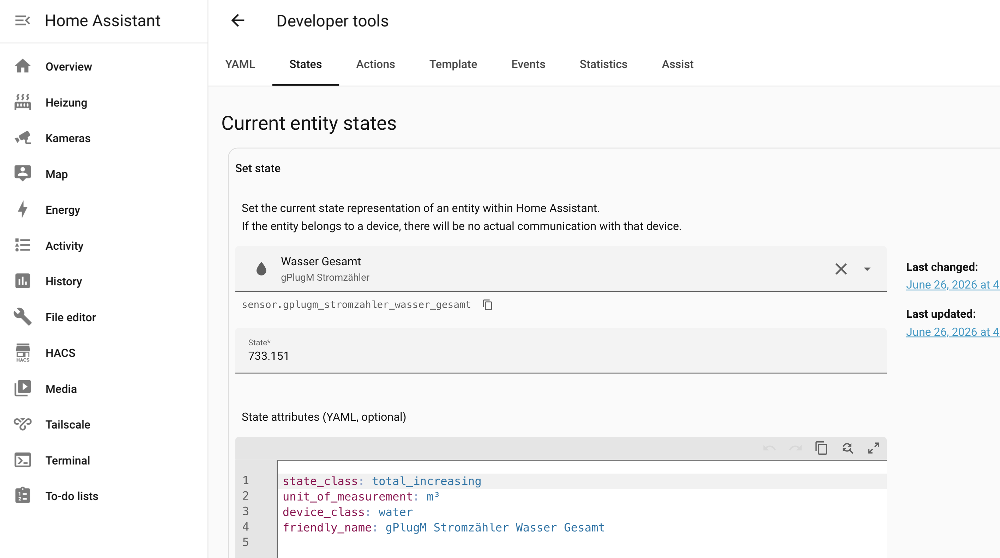
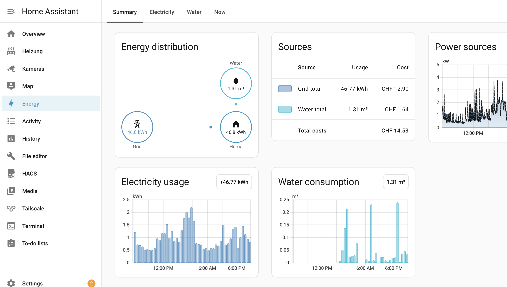
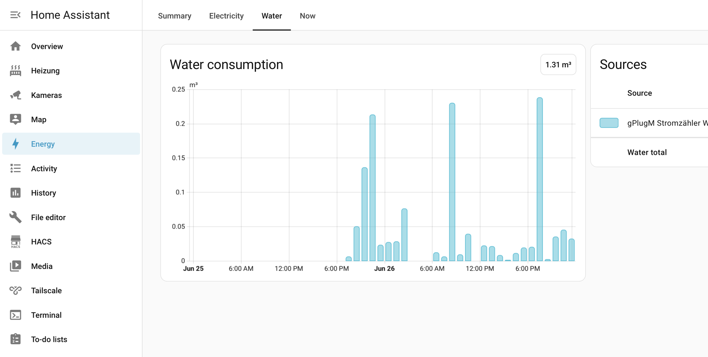
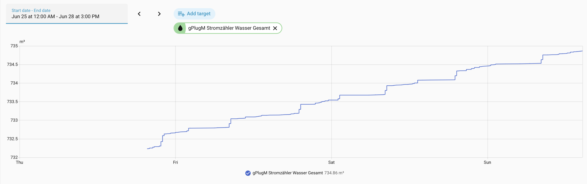

# Landis+Gyr E450 mit M-Bus-Funk-Wasserzähler in Home Assistant auslesen

**Strom *und* Wasser mit dem gPlugM auslesen – inklusive Dekodierung der M-Bus-Unterzähler.**

Eine vollständige, erprobte Schritt-für-Schritt-Anleitung am Beispiel eines Schweizer Smart Meters mit per Funk angebundenem Wasserzähler.

*Autor: Dr. Thomas Wiechert · Stand: Juni 2026 · Lizenz: [CC BY 4.0](LICENSE)*

> 💡 **Aktuellste Fassung:** Dieses Repository ist die gepflegte Master-Version. Korrekturen und Ergänzungen anderer Nutzer sind willkommen (siehe [Mitwirken](#mitwirken)).

---

## Inhalt

1. [Ausgangslage](#ausgangslage)
2. [Ist-Zustand](#ist-zustand)
3. [Vorgehen im Überblick](#vorgehen-im-überblick)
4. [Schritt 1 – Kontaktaufnahme mit dem Netzbetreiber](#1-kontaktaufnahme-mit-dem-netzbetreiber)
5. [Schritt 2 – gPlugM ins Netzwerk integrieren](#2-gplugm-ins-netzwerk-integrieren)
6. [Schritt 3 – gPlugM an den Smart Meter anschliessen](#3-gplugm-an-den-smart-meter-anschliessen-und-datenfluss-prüfen)
7. [Schritt 4 – MQTT-Verbindung herstellen](#4-mqtt-verbindung-herstellen)
8. [Schritt 5 – Stromwerte in Home Assistant](#5-stromwerte-in-home-assistant-einbinden)
9. [Schritt 6 – Der Wasserzähler (Kernstück)](#6-der-wasserzähler--das-kernstück)
10. [Schritt 7 – Wasserwert in Home Assistant](#7-wasserwert-in-home-assistant-einbinden)
11. [Schritt 8 – Utility-Meter-Helfer](#8-utility-meter-helfer-optional-aber-praktisch)
12. [Schritt 9 – Energie-Dashboard](#9-energie-dashboard-für-strom-und-wasser)
13. [Erkenntnisse und Stolpersteine](#erkenntnisse-und-stolpersteine)
14. [Mitwirken](#mitwirken)
15. [Dank](#dank)

---

## Ausgangslage

Bei mir in Suhr (AG) ist ein Smart Meter vom Typ **Landis+Gyr E450** installiert; Netzbetreiber sind die **Technischen Betriebe Suhr (TBS)**. An die Kundenschnittstelle dieses Zählers ist nicht nur die Stromzählung angebunden, sondern über **M-Bus** auch ein **per Funk gekoppelter Wasserzähler**.

Ich betreibe **Home Assistant** (HA) und wollte beides lokal auslesen: den **Stromverbrauch** (Hoch- und Niedertarif, Leistung, Phasenströme) **und** den **Wasserzählerstand**. Für den Strom gibt es bereits eine gute Anleitung im gPlug-Blog. Der Wasserzähler war dagegen deutlich anspruchsvoller – sein Wert steckt in einem speziellen Telegramm und an einer Position, die sich mit der einfachen OBIS-Suche nicht greifen lässt. Diese Anleitung dokumentiert den **kompletten Weg für Strom und Wasser** und schliesst damit die Lücke bei den M-Bus-Unterzählern.

> ⚠️ **Wichtiger Hinweis:** Wie die Schnittstelle konfiguriert ist – welche Kanäle aktiv sind, ob verschlüsselt, in welchem Takt – ist **netzbetreiberspezifisch**. Die hier gezeigten Werte stammen aus meiner konkreten Installation bei der TBS. Das **Vorgehen** ist übertragbar; einzelne Zahlen (insbesondere die Byte-Position des Wasserwerts) können bei Ihnen abweichen. Wie Sie Ihre eigenen ermitteln, steht in [Schritt 6](#6-der-wasserzähler--das-kernstück).

---

## Ist-Zustand

**Smart Meter**
- Landis+Gyr E450 (Kundenschnittstelle/CII vom Netzbetreiber freigeschaltet)
- Datenausgabe in meinem Fall **unverschlüsselt** (DLMS Security 0, dKEY leer)

**gPlugM IoT-Adapter**
- Modell gPlugM (Gantrisch Energie AG)
- Tasmota 15.3.0 (tasmota32), Build 2026.03.02, ESP32-C3

**Home Assistant**
- HA-Version: *[Ihre Version eintragen]*
- Add-ons: Mosquitto MQTT Broker; optional MQTT Explorer (für die Fehlersuche)

**Netzwerk**
- WLAN-Verbindung, privates IPv4-Subnetz nach RFC 1918, kein Zugriff aus dem Internet

---

## Vorgehen im Überblick

1. Kontaktaufnahme mit dem Netzbetreiber (Schnittstelle freischalten, Kanalbelegung erfragen)
2. gPlugM ins WLAN/IP-Netz integrieren
3. gPlugM an den Smart Meter anschliessen und Datenfluss prüfen
4. MQTT-Verbindung zwischen gPlugM und Home Assistant herstellen
5. Stromwerte als Sensoren in Home Assistant einbinden
6. **Wasserzähler auslesen** (das Kernstück: VIS4-Telegramm dekodieren)
7. Wasserwert in Home Assistant einbinden
8. Utility-Meter-Helfer für Tages-/Wochen-/Monatsverbrauch
9. Energie-Dashboard für Strom und Wasser

---

## 1. Kontaktaufnahme mit dem Netzbetreiber

Die Kundenschnittstelle des E450 muss vom Netzbetreiber **freigeschaltet** werden. Klären Sie dabei gleich:

- Welche Werte liefert der Zähler über die Schnittstelle?
- Werden die Daten **verschlüsselt** ausgegeben (und wenn ja, wie erhält man den Schlüssel)?
- **Welche M-Bus-Kanäle** sind belegt und mit welchem Gerätetyp/welcher Einheit?

In meinem Fall: Der Wasserzähler liegt auf **M-Bus-Kanal 2**, Ausgabe in **m³ mit drei Nachkommastellen**. Diese Angabe ist für Schritt 6 entscheidend.

**Hintergrundwissen:**
- M-Bus (Feldbus): <https://de.wikipedia.org/wiki/M-Bus_(Feldbus)> · <https://m-bus.com/>
- Landis+Gyr Standard-CIP-Liste: <https://www.landisgyr.ch/webfoo/wp-content/uploads/2025/03/LandisGyr_Standard-CIP-Liste.pdf>

---

## 2. gPlugM ins Netzwerk integrieren

Der gPlugM spannt beim ersten Start einen eigenen WLAN-Access-Point auf. Darüber im Browser das WLAN hinterlegen. Danach ist die Weboberfläche unter der IP des Geräts erreichbar.

**Firmware prüfen:** In der Konsole (**Werkzeuge → Konsole**) `status 2` eingeben. Bei mir: Tasmota 15.3.0 (tasmota32).

> ⚠️ **Tipp:** Spielen Sie **kein** Firmware-Update über die Standard-Tasmota-Funktion ein – das würde das spezielle gPlug-Script überschreiben. Sichern Sie vorab die Konfiguration (*Konfiguration sichern*).

---

## 3. gPlugM an den Smart Meter anschliessen und Datenfluss prüfen

Sobald die Schnittstelle freigeschaltet ist, den gPlugM an den Zähler stecken. Zeigt die Weboberfläche keine Werte, hilft ein Blick auf den rohen Datenstrom. In der Konsole:

```
sensor53 d1
```

Damit gibt der gPlugM den dekodierten DLMS-Block aus (mit `sensor53 d0` wieder ausschalten). Erscheint nur Unleserliches, werden die Daten möglicherweise **verschlüsselt** übertragen – dann muss der Netzbetreiber die Verschlüsselung deaktivieren oder den Schlüssel bereitstellen.



> ℹ️ **Interessant:** In meinem Fall liefert der Netzbetreiber unverschlüsselt (Security 0). Der von Tasmota als *„decrypted block"* ausgegebene Block entspricht damit direkt der Klartext-APDU.

---

## 4. MQTT-Verbindung herstellen

1. In HA das **Mosquitto-Broker-Add-on** installieren und starten; für den gPlugM einen **eigenen MQTT-Benutzer** anlegen (case-sensitiv).
2. Im gPlugM Broker-IP, Port (1883), Benutzer und Passwort eintragen.
3. In HA die **MQTT-Integration** mit demselben Broker einrichten.

Der gPlugM publiziert auf einem Topic der Form:

```
tele/gPlugM_<CHIPID>/SENSOR
```

`<CHIPID>` ist gerätespezifisch (bei mir `26BA98`). Die Nutzdaten stehen als JSON unter dem Schlüssel `z`, z.B. `Ei`, `Ei1`, `Ei2`, `Pi`, `I1`–`I3` – und nach Schritt 6 auch `Wasser`.

> ⚠️ **Tipp:** Mit dem Add-on **MQTT Explorer** lässt sich der eingehende Datenstrom bequem kontrollieren, bevor man die Sensoren definiert.

---

## 5. Stromwerte in Home Assistant einbinden

Der gPlugM liefert für diese Werte kein automatisches HA-Discovery, deshalb definiere ich die Sensoren **explizit per YAML** – das ergibt saubere Namen und eine korrekte Gerätegruppierung.



Ich halte die MQTT-Sensoren in einer eigenen Datei `mqtt.yaml` und binde sie in der `configuration.yaml` ein:

```yaml
mqtt: !include mqtt.yaml
```

In der `mqtt.yaml` dann die Sensoren als `sensor:`-Liste. Beispiel für den Gesamtbezug (das erste Gerät trägt die Geräte-Stammdaten):

```yaml
sensor:
  - name: "Strom Bezug Gesamt"
    unique_id: gplugm_ei
    state_topic: "tele/gPlugM_26BA98/SENSOR"
    value_template: "{{ value_json.z.Ei }}"
    unit_of_measurement: "kWh"
    device_class: energy
    state_class: total_increasing
    device:
      identifiers: [gplugm_26ba98]
      name: "gPlugM Stromzähler"
      manufacturer: "Gantrisch Energie"
      model: "gPlugM"
```

Weitere Sensoren – Hochtarif (`Ei1`), Niedertarif (`Ei2`), Einspeisung (`Eo`), Leistung (`Pi`/`Po`), Phasenströme (`I1`–`I3`) – werden analog ergänzt und verweisen über `identifiers: [gplugm_26ba98]` auf dasselbe Gerät. Beispiel Niedertarif:

```yaml
  - name: "Strom Bezug Niedertarif"
    unique_id: gplugm_ei2
    state_topic: "tele/gPlugM_26BA98/SENSOR"
    value_template: "{{ value_json.z.Ei2 }}"
    unit_of_measurement: "kWh"
    device_class: energy
    state_class: total_increasing
    device:
      identifiers: [gplugm_26ba98]
```

Nach dem Speichern: **Entwicklerwerkzeuge → YAML → Konfiguration prüfen**, dann **Manuell konfigurierte MQTT-Entitäten neu laden**.

> ⚠️ **Tipp:** Alternativ kann man die Tasmota-Auto-Discovery aktivieren und die erkannten Entitäten per `homeassistant: customize:` mit Einheiten versehen. Die explizite Definition oben ist aber übersichtlicher, vermeidet Doppel-Entitäten und gruppiert alles unter einem Gerät. `state_class: total_increasing` macht das früher übliche `last_reset` überflüssig.

---

## 6. Der Wasserzähler – das Kernstück

### 6.1 Warum die einfache Methode scheitert

Der Wasserwert liegt **nicht** in den schnellen 5-/60-Sekunden-Telegrammen, sondern nur im **900-Sekunden-Push** (Verbraucherinformation 4, kurz „VIS4"), getaktet auf `:00/:15/:30/:45`.

Dieses Telegramm hat beim L+G eine besondere DLMS-Struktur (von gPlug treffend **„Struktur-N-Array-N"** genannt):

- Eine **äussere Struktur mit N Elementen**.
- Deren **erstes Element** ist ein **Array** aus N Items – die **Objektliste** mit allen OBIS-Codes (das „Inhaltsverzeichnis"). Jedes Item ist wiederum eine Struktur aus vier Elementen, deren erstes der OBIS-Code ist.
- Die **eigentlichen Werte** folgen **danach**, gebündelt am Ende, jeweils mit ihrem DLMS-Typ-Tag (`06` = u32, `05` = s32, `11` = u8) und – ganz am Schluss – den Skalierungs-/Einheiten-Strukturen.

Diese Objektliste lässt sich auch in der Push-Konfiguration des Netzbetreibers ablesen. Hier die Verbraucherinformation 4 meiner TBS-Installation – man erkennt in Zeile 7 den Eintrag `0-2:24.2.1` „M-Bus Wert 1 Kanal 2" (mein Wasserzähler):



Daraus folgt das Problem: Der OBIS-Code `0-2:24.2.1` steht im Kopf, **sein Wert aber weit hinten** im Werteblock. Die Suche `pm(24.2.1)` findet nur den **ersten** Treffer – das ist **Kanal 1**. Bei mir ist Kanal 1 (drahtgebundener Wasserzähler) leer und liefert **0**.

Kanalbelegung bei der TBS (vorkonfiguriert vom Lieferanten):

| Kanal | Belegung | Status bei mir |
|---|---|---|
| 1 | Wasser, drahtgebunden | leer |
| **2** | **Wasser, drahtlos (Funk)** | **aktiv – mein Wasserzähler** |
| 4 | Energie- + Volumenregister (Wärmezähler-Vorkonfiguration) | leer |

> ℹ️ **Hinweis:** `pm(r…)` (Roh-Pattern-Suche) funktioniert bei L+G-Zählern **nicht**. Der richtige Weg ist die **positionsbasierte** Methode (Anker + Skip + Maske).

### 6.2 Das Telegramm mitschneiden

Den 900-Sekunden-Block mit `sensor53 d1` abgreifen. Er erscheint nur zur vollen Viertelstunde und ist deutlich länger als die Stromtelegramme.

> ⚠️ **Tipp:** Die Tasmota-Konsole ist zum Mitlesen unpraktisch (kleiner Puffer, springt). Am besten den Block einmal sauber kopieren und in Ruhe analysieren.

### 6.3 Den Wert lokalisieren

Im Werteblock erscheinen die Werte in derselben Reihenfolge wie die Objekte im Kopf. Bei der TBS-Belegung liegt der gesuchte **Kanal-2-Wert an Position 7 von 16**, markiert mit dem Typ-Tag `05` (s32):



Im Telegramm erscheint der Wert z.B. als:

```
… 05 00 0b 36 8f …
```

`0x000b368f = 734863`, mit Skalierer −3 also **734,863 m³** (genau der Wert, den auch die Weboberfläche und Home Assistant anzeigen).

### 6.4 Die finale Meter-Metrik-Zeile

Statt nach dem OBIS-Code zu suchen, spricht man die **feste Position** direkt an. Die Zeile wird im gPlug-Script ergänzt:

```
1,02100110x315xx05S32@1000,Wasser,m³,Wasser,3
```

| Element | Bedeutung |
|---|---|
| `02100110` | Anker auf das DLMS-Muster am Telegrammanfang (Struktur/Array-Kennung) |
| `x315` | 315 Bytes überspringen |
| `xx` | ein Wildcard-Byte (grenzt die Zahl sauber vom folgenden Muster ab) |
| `05S32` | hier einen s32-Wert (signed 32 Bit) mit DLMS-Tag `05` lesen |
| `@1000` | durch 1000 teilen (aus `734863` wird `734,863`) |
| Rest | Anzeigename, Einheit `m³`, Variablenname `Wasser`, 3 Nachkommastellen |

> ⚠️ **Wichtig – installationsabhängig:** Der Skip-Wert (`315`) und die Position ergeben sich aus *Ihrem* Telegramm und der Kanalbelegung Ihres Netzbetreibers. Ändert sich die Belegung, verschiebt sich die Position. Ermitteln Sie Anker und Skip anhand Ihres eigenen Mitschnitts (6.2/6.3).

Nach dem Speichern zeigt der gPlugM beim nächsten Viertelstunden-Push den Wasserstand an:



---

## 7. Wasserwert in Home Assistant einbinden

Analog zu den Stromsensoren – ans Ende der `sensor:`-Liste in `mqtt.yaml`:

```yaml
  - name: "Wasser Gesamt"
    unique_id: gplugm_wasser
    state_topic: "tele/gPlugM_26BA98/SENSOR"
    value_template: "{{ value_json.z.Wasser }}"
    unit_of_measurement: "m³"
    device_class: water
    state_class: total_increasing
    device:
      identifiers: [gplugm_26ba98]
```

`device_class: water` und `state_class: total_increasing` sind entscheidend – nur damit erkennt HA den Sensor als gültigen **Wasserzähler** und bietet ihn im Energie-Dashboard an. Danach erneut **Konfiguration prüfen** und **MQTT-Entitäten neu laden**.



---

## 8. Utility-Meter-Helfer (optional, aber praktisch)

Mit dem **Utility Meter** lässt sich aus einem Zählerstand automatisch der Verbrauch je Tag/Woche/Monat/Jahr ableiten – ideal fürs Dashboard und eigene Auswertungen:

```yaml
utility_meter:
  strom_taeglich:
    source: sensor.gplugm_stromzahler_strom_bezug_gesamt
    cycle: daily
  strom_monatlich:
    source: sensor.gplugm_stromzahler_strom_bezug_gesamt
    cycle: monthly
  wasser_taeglich:
    source: sensor.gplugm_stromzahler_wasser_gesamt
    cycle: daily
  wasser_monatlich:
    source: sensor.gplugm_stromzahler_wasser_gesamt
    cycle: monthly
```

Mehr dazu: <https://www.home-assistant.io/integrations/utility_meter/>

> ℹ️ **Hinweis:** Die genauen Entitätsnamen (mit Geräte-Präfix `gplugm_stromzahler_…`) prüfen Sie unter **Entwicklerwerkzeuge → Zustände**.

---

## 9. Energie-Dashboard für Strom und Wasser

1. **Einstellungen → Dashboards → Energie**.
2. **Stromnetz**: unter *Netzbezug* die Energie-Entität(en) hinzufügen – für getrennte Tarife `Ei1` und `Ei2` mit den jeweiligen Preisen.
3. **Wasserverbrauch → Wasserquelle hinzufügen**: den Wasser-Sensor wählen, optional Preis pro m³ hinterlegen.





> ℹ️ **Hinweis:** Das Dashboard zeigt **Verbrauch** (Differenz), nicht den Zählerstand. Die ersten Balken erscheinen also erst, sobald sich der Wert verändert hat.

---

## Erkenntnisse und Stolpersteine

- **`pm(r…)` funktioniert beim L+G nicht** – der positionsbasierte Weg (Anker/Skip/Maske) ist hier richtig.
- **Der Wert steht nicht hinter seinem OBIS-Code**, sondern gebündelt am Telegrammende – darum scheitert die OBIS-Suche, und der erste `24.2.1`-Treffer ist der (oft leere) Kanal 1.
- **`total_increasing` + passende `device_class`** sind Pflicht, damit Energie-Dashboard und Statistik den Zähler erkennen.
- **VIS4 nur zur vollen Viertelstunde** – zwischendurch bleibt der Wert konstant; das ist kein Fehler.
- **Kein Firmware-Update** über Standard-Tasmota – es würde das gPlug-Script überschreiben. Vorher Konfiguration sichern.
- **HA-Historie statt Konsole** zur Verlaufskontrolle nutzen. So habe ich auch festgestellt, dass der Wasserwert bei mir tatsächlich **alle 15 Minuten** frisch übermittelt wird (nicht nur einmal täglich):



---

## Mitwirken

Die Byte-Position des Wasserwerts (Anker/Skip) ist **netzbetreiber- und konfigurationsabhängig**. Wenn Sie diese Anleitung bei einem anderen Netzbetreiber oder mit anderer Kanalbelegung erfolgreich angewendet haben, freue ich mich über einen Beitrag (Issue oder Pull Request) mit Ihren Werten – so entsteht mit der Zeit eine Referenz, die mehrere Schweizer Netzbetreiber abdeckt.

| Netzbetreiber | Zählertyp | Wasserkanal | Anker / Skip-Wert | Quelle |
|---|---|---|---|---|
| TBS (Suhr) | L+G E450 | 2 | `02100110` / `315` | diese Anleitung |
| *(Ihr Beitrag)* | | | | |

---

## Dank

Die Dekodierung des VIS4-Telegramms und die finale Meter-Metrik entstanden mit tatkräftiger Unterstützung von **Hermann Hüni / gPlug (Gantrisch Energie AG)**. Merci!

---

*Angaben ohne Gewähr; netzbetreiberspezifische Abweichungen sind möglich. Lizenz: [CC BY 4.0](LICENSE) – frei nutzbar mit Namensnennung.*
